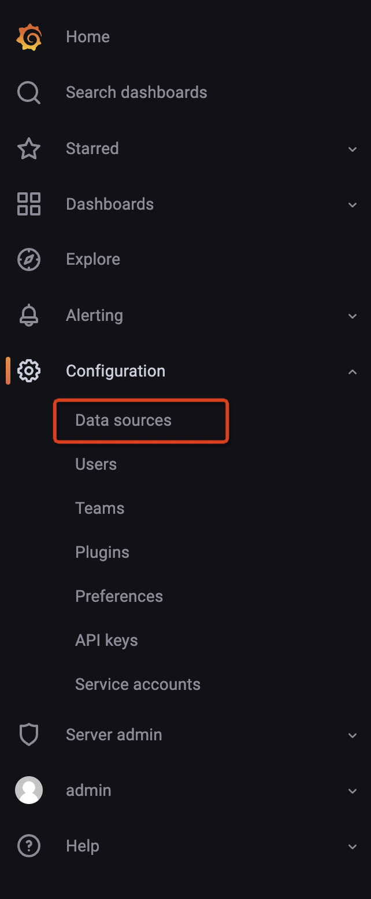
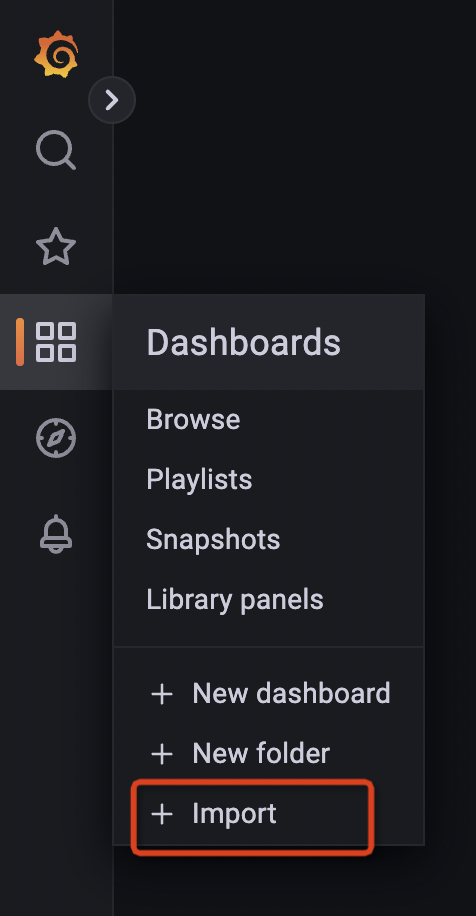
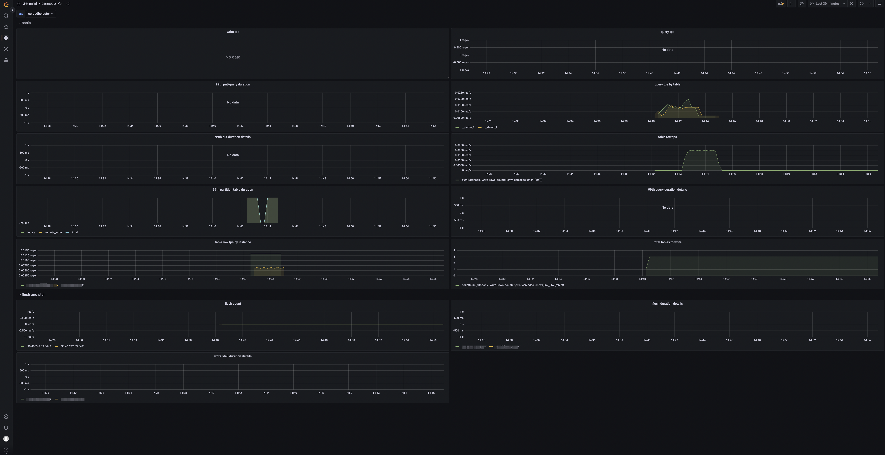

# Observability

CeresDB is observable with Prometheus and Grafana.

## Prometheus

[Prometheus](https://github.com/prometheus/prometheus) is a systems and service monitoring system.

### Configuration

Save the following configuration into the `prometheus.yml` file. For example, in the `tmp` directory, `/tmp/prometheus.yml`.

Two ceresdb http service are started on localhost:5440 and localhost:5441.

```yaml
global:
  scrape_interval: 30s

scrape_configs:
  - job_name: ceresdb-server
    static_configs:
    - targets: [your_ip:5440, your_ip:5441]
      labels:
        env: ceresdbcluster
```

See details about configuration [here](https://prometheus.io/docs/prometheus/latest/configuration/configuration/).

### Run

You can use docker to start Prometheus. The docker image information is [here](https://hub.docker.com/r/prom/prometheus).

```
docker run \
    -d --name=prometheus \
    -p 9090:9090 \
    -v /tmp/prometheus.yml:/etc/prometheus/prometheus.yml \
    prom/prometheus:v2.41.0
```
For more detailed installation methods, refer to [here](https://prometheus.io/docs/prometheus/latest/installation/).


## Grafana

[Grafana](https://github.com/grafana/grafana) is a open and composable observability and data visualization platform.

### Run

You can use docker to start grafana. The docker image information is [here](https://hub.docker.com/r/grafana/grafana).

```
docker run -d --name=grafana -p 3000:3000 grafana/grafana:v8.2.6
```

Default admin user credentials are admin/admin.

Grafana is available on http://127.0.0.1:3000.

For more detailed installation methods, refer to [here](https://grafana.com/docs/grafana/latest/setup-grafana/installation/).

### Configure data source

1. Hover the cursor over the Configuration (gear) icon.
2. Select Data Sources.
3. Select the Prometheus data source.

Note: The url of Prometheus is `http://your_ip:9090`.



See more details [here](https://grafana.com/docs/grafana/latest/datasources/prometheus/).

### Import grafana dashboard

<a href="./resources/grafana-dashboard.json">dashboard json</a>



## CeresDB Metrics

After importing the dashboard, you will see the following page:



### Panels
* tps: Number of cluster write requests.
* qps: Number of cluster query requests.
* 99th query/write duration: 99th quantile of write and query duration.
* query by table: Query group by table.
* 99th write duration details by instance: 99th quantile of write duration group by instance.
* 99th query duration details by instance: 99th quantile of query duration group by instance.
* 99th write partition table duration: 99th quantile of write duration of partition table.
* rows by table: The rows of data written to each table.
* table rows by instance: The written rows by instance.
* total tables to write: Number of tables with data written.
* flush count: Number of ceresdb flush.
* 99th flush duration details by instance: 99th quantile of flush duration group by instance.
* 99th write stall duration details by instance: 99th quantile of write stall duration group by instance.