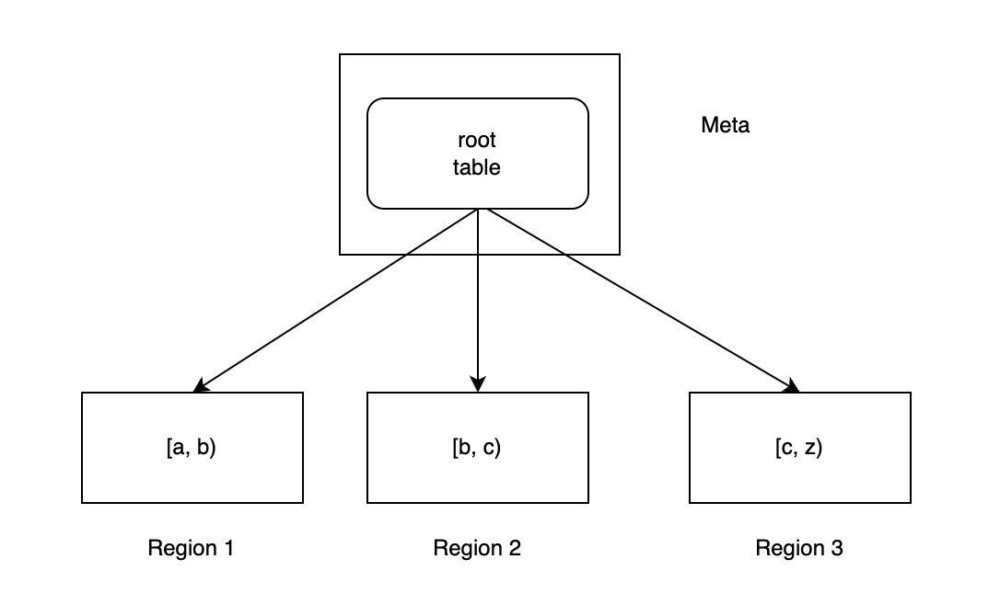

- Feature Name: New engine for storing massive metrics data
- Tracking Issue: NA

> Note: This document is only available in Chinese and can be translated into the desired language using services such as Google Translate.

# Summary

新引擎的目标：
- 管理大量 metrics 数据，单个指标下，时间线量级到亿级别
- 高效的数据检索（Scan + Filter）

# Motivation

目前的 Analytic Engine 对于管理大量 metrics 数据有如下问题：
1. 以表为资源管理单元，不适合管理 10w+ 的表
2. 基于 Arrow + Datafusion 的查询框架，丢失时间线信息，导致单个查询会占用较多资源

# Details

## 表管理

主要有两个目标：
1. 复用现有的 meta 基于 Shard、表的调度能力
2. 与 AnalyticMetric 平级，可以尽可能复用 Frontend 层（处理 GRPC/HTTP ）的逻辑（比如：转发）。

### 方案



说明：
- Region 对应现在的 Shard 逻辑
- meta 内只有一张表，即 root，它是一个 super 表，采用 range 分区
- Range 分区管理的详见后面的扩容方案小节
- 分区的计算方式是：`hash(metric + sorted_tags)` ，之后根据 ID 在 Range 的范围确定所在 Region

本方案缺点：
1. 没法做到指标级别 TTL

### 扩容方案

假设现在有如下分区布局：

| Row Key | Region ID |
| --- | --- |
| [A, H) | 1 |
| [H, S) | 2 |
| [S, Z) | 3 |

如果发现 Region 1 有热点，那么可以新增 Region 4，并添加如下规则：
```sql
alter table root
  split partition region_1 into [A,E), [E, H);
```
这样 `[A,E)`还会写到 Region1 中，而 `[E, H)`则会写入新的 Region（系统会自动创建）。
这时 `[A, H)`的分区可以删掉，写入时根据最新的路由规则进行，查询时由于无法精确到 Region，所以只能查询所有 Region。

### 问题讨论
如果查询时可以定位到涉及的 Region，比如 ID 采用 `hash(metric+固定TagKey)` 的生成方式，那么在分裂时可以通过记录 Region TTL 的方式来减少查询所涉及的 Region 范围。
对于上面的分裂 case 来说，对于 `[A, E)` 写入、查询路由不变  `[E, H)`则需要根据时间戳来区分，假设 split 的分区时间为 t，表的 TTL 为 30d，那么

| 查询范围 | 设计 Region | 分区规则 | 规则 TTL |
| --- | --- | --- | --- |
| [0, t) | 1 | [A, H) | t+30d |
| [t, MAX) | 4 | [E, H) | MAX |

相当于每个分区规则也有一个 TTL，默认是 MAX，在分裂时，会自动更新老分区规则的 TTL。在分裂 region1 后各个规则的 TTL 如下：

| 规则 | TTL | CreatedAt |
| --- | --- | --- |
| [A, H) | t+30 | |
| [A, E) | MAX | t |
| [E, H) | MAX | t |
| [H, S) | MAX | |
| [S, Z) | MAX | |

写入时是需要找到对应区间内 TTL 最大的即可，查询则需要根据时间戳来与分区键来路由。

## 索引设计

索引的设计主要参考 VM，VM 中的所有索引结构采用平铺方式（即 opaque byte slices ）保存在 [MergeSet](https://pkg.go.dev/github.com/VictoriaMetrics/VictoriaMetrics/lib/mergeset) 结构中，主要有如下几种：
1. `metricName -> metricID`， metricName 包含指标名与所有 label 对
2. `metricID -> metricName`
3. `label=value -> metricID`， label 到 metricID 的倒排，用于加速待 label 的过滤查询


不同的索引结构通过固定 prefix 来区分，这样可以保证 Scan 的高效。HoraeDB 在参考这种做法的基础上，设计了如下几种索引结构：

```
metrics: {Date}-{MetricName}-{MetricID}-{FieldName}

series: {Date}-{TSID}-{SeriesKey}

tags: {Date}-{TagKey}-{TagValue}  <可选>

index: {Date}-{TagKey}-{TagValue}-{TSID}
```

- Date 默认为天
- TSID，与 metricID 作用类似，但采用 Hash 方式生成
- SeriesKey 为所有排序后的 TagKV

采用 Table 来管理上述结构，不同字段可以直接对应 parquet 的一个列，便于进行针对性 encoding。
如果采用类似 VM 这种 opaque byte 的方式，就失去了对不同类型针对性优化的可能性。
与 VM 不同的是，Date 属性通过 segment duration 来表示，并不会单独记录一列，每个 SST 会记录 min/max 时间戳，便于在 compact 阶段进行数据淘汰。

对于上述索引结构，需要四类表，结构定义如下：

**metrics**

| MetricName | MetricId | FieldName | FieldId | FieldType |
| --- | --- | --- | --- | --- |
| string | uint64 | string | uint32 | uint8 |

**series**

| MetricId | TSID | SeriesKey |
| --- | --- | --- |
| uint64 | uint64 | bytes |

**tags(可选)**
这个表是为了加速 LabelValues 的查询，如果没有的话，也可以通过 index 表查出来，具体来说分两步：

1. 先用 filter 的 label 过滤出 TSID
2. 用筛选出的 TSID 在 series 表中查找对应 SeriesKey，并从其中提取出对应 label 的 value

VM 就是采用上述做法。

| MetricID | TagKey | TagValue |
| --- | --- | --- |
| uint64 | bytes | bytes |

**index**

| MetricID | TagKey | TagKey | TSID |
| --- | --- | --- | --- |
| uint64 | bytes | bytes | uint64 |

每个表采用 4.0 中 segment_duration 的方式来管理，便于基于时间戳在 compact 阶段进行淘汰。

### 示例

```
1 http_requests{url="/api/put", code="200", job="proxy"} 100 2024-08-15
2 http_requests{url="/api/query", code="200", job="proxy"} 10 2024-08-15
```
需要的表数据
#### metrics
metadata: min_timestamp: 2024-08-15, max_timestamp: 2024-08-15,

| MetricName | MetricId | FieldName | FieldId | FieldType |
| --- | --- | --- | --- | --- |
| http_requests | 1 | value | 1 | 0 |

#### series
| MetricId | TSID | SeriesKey |
| --- | --- | --- |
| 1 | 1 | {code=200, job=proxy, url=/api/put} |
| 1 | 2 | {code=200, job=proxy, url=/api/query} |

#### Tags（可选）

| MetricId | TagKey | TagValue |
| --- | --- | --- |
| 1 | code | 200 |
| 1 | job | proxy |
| 1 | url | /api/put  |
| 2 | code | 200 |
| 2 | job | proxy |
| 2 | url | /api/query  |

####  index
| MetricId | TagKey | TagKey | TSID |
| --- | --- | --- | --- |
| 1 | code | 200 | 1 |
| 1 | code | 200 | 2 |
| 1 | job | proxy | 1 |
| 1 | job | proxy | 2 |
| 1 | url | /api/put | 1 |
| 1 | url | /api/query | 2 |

### 问题讨论

在 VM 中，指标名通过 `__name__` 这个特殊的 TagKey 来表示，没有单独的 metric 这个表，这样的好处是简单，但可能会导致索引膨胀问题。分析如下：

假设有如下数据
```
1 http_requests_latency_bucket{le="0.1"}
2 http_requests_latency_bucket{le="0.2"}
3 http_requests_latency_bucket{le="0.3"}
4 grpc_requests_latency_bucket{le="0.1"}
```
在 VM 中，会有如下 index 结构

| 序号 | index rows |
| --- | --- |
| 1 | le=0.1 => 1 |
| 2 | le=0.1 => 4 |
| 3 | le=0.2 => 2 |
| 4 | le=0.3 => 3 |
| 5 | `__name__=http_requests_latency_bucket => 1` |
| 6 | `__name__=http_requests_latency_bucket => 2` |
| 7 | `__name__=http_requests_latency_bucket => 3` |
| 8 | `__name__=grpc_requests_latency_bucket => 4` |
| 9 | http_requests_latency_bucket, le=0.1 => 1 |
| 10 | http_requests_latency_bucket, le=0.1 => 4 |
| 11 | http_requests_latency_bucket, le=0.2 => 2 |
| 12 | grpc_requests_latency_bucket, le=0.3 => 3 |

在 HoraeDB， 只会记录 9-12 这四条数据。
VM 这样的好处是为了可以查询没有指定 metric name 的查询，为了满足这类查询，HoraeDB 也需要新建额外的索引 TagKV => metric ，查询分两步：

1. 根据 filter 的 tag 查出对应 metric
2. 根据 metric 再去走正常的查询流程

很明显这这种方式会比较低效，但这类查询比较低频，RT 高些也是可以接受的，而这种方式的优势就是记录的索引大大减少了。


## 数据设计

与索引设计类似，采用带 segment duation 的表来管理

| MetricID | TSID | FieldID | Timestamp | Value |
| --- | --- | --- | --- | --- |
| uint64 | uint64 | int32 | opaque bytes |  opaque bytes |

Timestamp 与 Value 上层自己编码，会进行数据攒批，比如会把 30 分钟的数据压缩到一行里面。

为了能够快速定位数据，做如下几点设计：
1. 前三列为主键，在写入时会排好序，这样就可以利用 parquet 自身的 min/max 信息来过滤不需要的数据。
2. 由于 Timestamp 会进行压缩，因此这一列的 min/max 数据需要我们自己来更新，不能依赖 parquet-rs。

此外，每个 SST 文件会对应一个 sequence，不同文件之间 compact 时，如果遇到主键相同，时间戳相同的数据，需根据 seq 来进行数据去重，seq 大的为最新的值。
