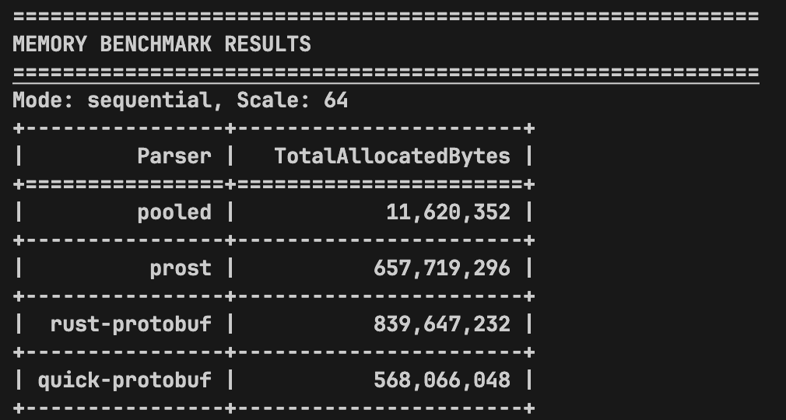

# Remote Write Parser

A hand-written [Prometheus Remote Write Request (V1)](https://prometheus.io/docs/specs/prw/remote_write_spec/) parser optimized for zero-allocation parsing. It receives protobuf data as `Bytes` and returns a parsed `WriteRequest` instance.

## Implementation

Key optimization techniques:

- Object pooling backed by deadpool.

- `RepeatedField` data structures.

- Zero-copy bytes split backed by unsafe.

- Manual loop unrolling and function inline optimization.

## Usage

This crate parses the protobuf `string` type as Rust `Bytes` instances instead of `String` instances to avoid allocation, and it **does not** perform UTF-8 validation when parsing. Therefore, it is up to the caller to decide how to make use of the parsed `Bytes` and whether to apply UTF-8 validation.

### Basic Usage

Synchronous parse:

```rust
use bytes::Bytes;
use remote_write::pooled_parser::PooledParser;

let parser = PooledParser::default();
let request = parser.decode(data)?; // Return a `PooledWriteRequest` instance.
```

Asynchronous parse:

```rust
use bytes::Bytes;
use remote_write::pooled_parser::PooledParser;

let parser = PooledParser::default();
let request = parser.decode_async(data).await?; // Return a deadpool object wrapper.

// Access the parsed data through the deadpool object wrapper.
println!("Parsed {} timeseries", request.timeseries.len());
for ts in &request.timeseries {
    for label in &ts.labels {
        let name = String::from_utf8_lossy(&label.name);
        let value = String::from_utf8_lossy(&label.value);
        println!("Label: {}={}", name, value);
    }
}
// Object automatically returned to the pool when dropped.
```

Note: if you use `decode_async()`, you need to add `deadpool` to your dependencies:

```toml
[dependencies]
deadpool = { workspace = true }  # or "0.10" if not inside this workspace.
```

### Enable Unsafe Optimization

```toml
[dependencies]
remote_write = { path = ".", features = ["unsafe-split"] }
```

This feature enables zero-copy bytes split that bypasses Rust's memory safety guarantees. The parsed `Bytes` instances **cannot outlive** the input raw protobuf `Bytes` instance.

Correct usage example:

```rust
use bytes::Bytes;
use remote_write::pooled_parser::PooledParser;

// CORRECT: consume immediately.
async fn foo() -> Result<Vec<String>, Box<dyn Error>> {
    let raw_data = load_protobuf_data(); // Bytes.
    let parser = PooledParser::default();
    let request = parser.decode_async(raw_data).await?;

    let metric_names: Vec<String> = request
        .timeseries
        .iter()
        .flat_map(|ts| ts.labels.iter())
        .filter(|label| label.name.as_ref() == b"__name__")
        .filter_map(|label| String::from_utf8(label.value.to_vec()).ok())
        .collect();

    Ok(metric_names)
}
```

Wrong usage example:

```rust
// WRONG: returned parsed data outlives the input.
fn bar() -> PooledWriteRequest {
    let raw_data = load_protobuf_data(); // Bytes
    let parser = PooledParser::default();
    parser.decode(raw_data).unwrap()
    // The input `raw_data` is dropped here, but the returned `PooledWriteRequest` outlives it.
}
```

## Performance

This section presents comprehensive performance analysis of the hand-written pooled parser compared to other popular Rust protobuf libraries ([prost](https://github.com/tokio-rs/prost), [rust-protobuf](https://github.com/stepancheg/rust-protobuf), [quick-protobuf](https://github.com/tafia/quick-protobuf)) and the [easyproto](https://github.com/VictoriaMetrics/easyproto) (Go) implementation. All tests were conducted on Ubuntu 22.04.4 LTS x86_64 with AMD EPYC 7742 (8) @ 2.249GHz CPU and 16GB RAM.

### Prerequisites

Install the required dependencies:

```shell
cargo install pb-rs
pip3 install tabulate matplotlib
```

### CPU Time

#### Steps

Navigate to the benchmarks directory:

```shell
cd src/benchmarks
```

Run the standard benchmarks:

```shell
BENCH_CONFIG_PATH=config.toml cargo bench --bench bench remote_write
```

Or enable unsafe optimization for better performance:

```shell
BENCH_CONFIG_PATH=config.toml cargo bench --features unsafe-split --bench bench remote_write
```

We also benchmarked against the [easyproto](https://github.com/VictoriaMetrics/easyproto) library for comparison:

```shell
git clone https://github.com/VictoriaMetrics/VictoriaMetrics.git
git checkout d083ff790a203ecda1cbbd527c792ef19c159f91
cd VictoriaMetrics/lib/prompb
vim prom_decode_bench_test.go
```

and add the following code (please change the path of 1709380533560664458.data):

```go
package prompb

import (
    "fmt"
    "os"
    "sync"
    "testing"
)

type Decoder interface {
    Parse(data []byte) error
    Reset()
    Clone() Decoder
}

type PooledDecoder struct {
    pool *sync.Pool
}

func NewPooledDecoder() *PooledDecoder {
    pool := &sync.Pool{
        New: func() interface{} {
            return &WriteRequest{}
        },
    }
    return &PooledDecoder{pool: pool}
}

func (d *PooledDecoder) Parse(data []byte) error {
    wr := d.pool.Get().(*WriteRequest)
    defer d.pool.Put(wr)
    wr.Reset()
    return wr.UnmarshalProtobuf(data)
}

func (d *PooledDecoder) Reset() {
    // Pool handles reset internally.
}

func (d *PooledDecoder) Clone() Decoder {
    return d
}

type NoPoolDecoder struct {
    wr *WriteRequest
}

func NewNoPoolDecoder() *NoPoolDecoder {
    return &NoPoolDecoder{
        wr: &WriteRequest{},
    }
}

func (d *NoPoolDecoder) Parse(data []byte) error {
    d.wr.Reset()
    return d.wr.UnmarshalProtobuf(data)
}

func (d *NoPoolDecoder) Reset() {
    d.wr.Reset()
}

func (d *NoPoolDecoder) Clone() Decoder {
    return NewNoPoolDecoder()
}

func getTestDataPath() ([]byte, error) {
    return os.ReadFile("1709380533560664458.data")
}

// Sequential benchmark.
func benchDecoderSequential(decoder Decoder, data []byte, n int) error {
    for i := 0; i < n; i++ {
        decoder.Reset()
        if err := decoder.Parse(data); err != nil {
            return err
        }
    }
    return nil
}

// Concurrent benchmark.
func benchDecoderConcurrent(decoder Decoder, data []byte, workers int) error {
    results := make(chan error, workers)

    // Spawn workers (similar to tokio::spawn in Rust).
    for w := 0; w < workers; w++ {
        go func() {
            clonedDecoder := decoder.Clone()
            clonedDecoder.Reset()
            err := clonedDecoder.Parse(data)
            results <- err
        }()
    }

    // Wait for all workers to complete (similar to join_handle.await).
    for w := 0; w < workers; w++ {
        if err := <-results; err != nil {
            return err
        }
    }
    return nil
}

func BenchmarkSequentialParse(b *testing.B) {
    data, err := getTestDataPath()
    if err != nil {
        b.Skipf("test data file not found: %v", err)
    }

    decoders := map[string]Decoder{
        "pooled": NewPooledDecoder(),
        "nopool": NewNoPoolDecoder(),
    }

    iterations := []int{1, 5, 10, 20, 100}

    for decoderName, decoder := range decoders {
        for _, n := range iterations {
            b.Run(fmt.Sprintf("%s/%d", decoderName, n), func(b *testing.B) {
                b.ResetTimer()
                for i := 0; i < b.N; i++ {
                    if err := benchDecoderSequential(decoder, data, n); err != nil {
                        b.Fatalf("failed to parse: %v", err)
                    }
                }
            })
        }
    }
}

func BenchmarkConcurrentParse(b *testing.B) {
    data, err := getTestDataPath()
    if err != nil {
        b.Skipf("test data file not found: %v", err)
    }

    decoders := map[string]Decoder{
        "pooled": NewPooledDecoder(),
        "nopool": NewNoPoolDecoder(),
    }

    workers := []int{1, 5, 10, 20, 100}

    for decoderName, decoder := range decoders {
        for _, w := range workers {
            b.Run(fmt.Sprintf("%s/%d", decoderName, w), func(b *testing.B) {
                b.ResetTimer()
                for i := 0; i < b.N; i++ {
                    if err := benchDecoderConcurrent(decoder, data, w); err != nil {
                        b.Fatalf("failed to parse: %v", err)
                    }
                }
            })
        }
    }
}
```

Execute the Go benchmarks:

```shell
go test -bench=. -run=^$
```

#### Results

Test results are as follows:


In sequential parsing scenarios, the hand-written pooled parsers (with and without unsafe optimization) achieve the best performance across all scales compared to other Rust parsers. The unsafe optimization provides nearly 50% performance improvement.


**Note**: Due to the nature of concurrent execution, concurrent parsing benchmark results may vary (sometimes dramatically) across different runs. However, we can still draw an overall conclusion.

In concurrent parsing scenarios, from an overall perspective, the hand-written pooled parsers (with and without unsafe optimization) still achieve the best performance compared to other Rust parsers. The unsafe optimization continues to provide performance improvements.

### Memory Allocation

Navigate to the benchmarks directory:

```shell
cd src/benchmarks
```

Run memory allocation benchmarks:

```shell
python3 remote_write_memory_bench.py --mode sequential --scale 10
```

Or enable unsafe optimization:

```shell
python3 remote_write_memory_bench.py --mode concurrent --scale 10 --unsafe
```

**Note**: Sequential and concurrent mode results are similar due to the enforced `#[tokio::main(flavor = "current_thread")]` configuration. This constraint is necessary because Jemalloc's `thread::allocatedp` and `thread::deallocatedp` statistics can only track single-threaded allocations accurately.

We focus on the [allocatedp](https://docs.rs/tikv-jemalloc-ctl/0.6.0/tikv_jemalloc_ctl/thread/struct.allocatedp.html) value to verify our zero-allocation parsing efforts, since it represents the number of bytes that **have ever been** allocated by the thread.

The results are as follows:



The hand-written pooled parser allocates minimal memory compared to other Rust parsers. Note that the difference between `ThreadAlloc` and `ThreadDealloc` in the pooled decoder is expected since we gather statistics right before the program terminates and objects remain in the pool (not freed) at that time.

### Object Pool Efficiency

Navigate to the benchmarks directory:

```shell
cd src/benchmarks
```

Analyze pool utilization:

```shell
cargo run --bin pool_stats --release
```

Our testing finds that only 8 objects in the pool are sufficient to handle 500 concurrent parsing operations.

## Acknowledgements

The two test data files in `src/remote_write/tests/workloads` are taken from [prom-write-request-bench](https://github.com/v0y4g3r/prom-write-request-bench/tree/main/assets).
