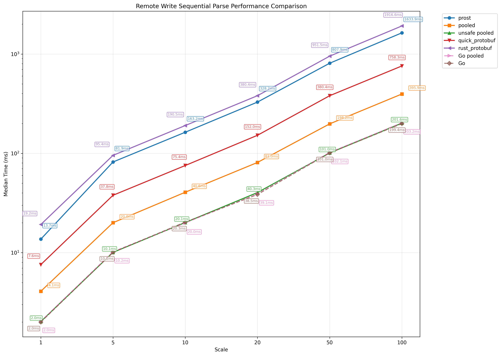

# Remote Write Parser

A hand-written [Prometheus Remote Write Request (V1)](https://prometheus.io/docs/specs/prw/remote_write_spec/) parser optimized for zero-allocation parsing. It receives protobuf data as `Bytes` and returns a parsed `WriteRequest` instance.

## Implementation

Key optimization techniques:

- Object pooling backed by [object-pool](https://github.com/CJP10/object-pool).

- `RepeatedField` data structures.

- Zero-copy bytes split backed by unsafe.

- Manual loop unrolling and function inline optimization.

## Performance

This section presents comprehensive performance analysis of the hand-written pooled parser compared to other popular Rust protobuf libraries ([prost](https://github.com/tokio-rs/prost), [rust-protobuf](https://github.com/stepancheg/rust-protobuf), [quick-protobuf](https://github.com/tafia/quick-protobuf)) and the [easyproto](https://github.com/VictoriaMetrics/easyproto) (Go) implementation. All tests were conducted on Ubuntu 22.04.4 LTS x86_64 with AMD EPYC 7742 (8) @ 2.249GHz CPU and 16GB RAM.

### Prerequisites

Install the required dependencies:

```shell
cargo install pb-rs
pip3 install tabulate matplotlib
```

### CPU Time

#### Benchmark Logic

We benchmarked both sequential and concurrent parsing scenarios. In the sequential case, we simply executed the parsing task `scale` times within a for loop. In the concurrent case, we spawned a number of system-level threads equal to the number of CPU cores and evenly distributed the `scale` parsing tasks among them, with each thread performing sequential parsing in a for loop.

**Note**: Since Go cannot directly create a system-level thread like `std::thread::spawn` in Rust, we ignored the concurrent benchmark logic for Go.

#### Steps

Navigate to the benchmarks directory:

```shell
cd src/benchmarks
```

Run the standard benchmarks:

```shell
BENCH_CONFIG_PATH=config.toml cargo bench --bench bench remote_write
```

Or enable unsafe optimization for better performance:

```shell
BENCH_CONFIG_PATH=config.toml cargo bench --features unsafe-split --bench bench remote_write
```

We also benchmarked against the [easyproto](https://github.com/VictoriaMetrics/easyproto) library for comparison:

```shell
git clone https://github.com/VictoriaMetrics/VictoriaMetrics.git
git checkout d083ff790a203ecda1cbbd527c792ef19c159f91
cd VictoriaMetrics/lib/prompb
vim prom_decode_bench_test.go
```

and add the following code (please change the path of `1709380533560664458.data`):

```go
package prompb

import (
    "fmt"
    "os"
    "sync"
    "testing"
)

type Decoder interface {
    Parse(data []byte) error
    Reset()
    Clone() Decoder
}

type PooledDecoder struct {
    pool *sync.Pool
}

func NewPooledDecoder() *PooledDecoder {
    pool := &sync.Pool{
        New: func() interface{} {
            return &WriteRequest{}
        },
    }
    return &PooledDecoder{pool: pool}
}

func (d *PooledDecoder) Parse(data []byte) error {
    wr := d.pool.Get().(*WriteRequest)
    defer d.pool.Put(wr)
    wr.Reset()
    return wr.UnmarshalProtobuf(data)
}

func (d *PooledDecoder) Reset() {
    // Pool handles reset internally.
}

func (d *PooledDecoder) Clone() Decoder {
    return d
}

type NoPoolDecoder struct {
    wr *WriteRequest
}

func NewNoPoolDecoder() *NoPoolDecoder {
    return &NoPoolDecoder{
        wr: &WriteRequest{},
    }
}

func (d *NoPoolDecoder) Parse(data []byte) error {
    d.wr.Reset()
    return d.wr.UnmarshalProtobuf(data)
}

func (d *NoPoolDecoder) Reset() {
    d.wr.Reset()
}

func (d *NoPoolDecoder) Clone() Decoder {
    return NewNoPoolDecoder()
}

func getTestDataPath() ([]byte, error) {
    return os.ReadFile("1709380533560664458.data")
}

// Sequential benchmark.
func benchDecoderSequential(decoder Decoder, data []byte, n int) error {
    for i := 0; i < n; i++ {
        decoder.Reset()
        if err := decoder.Parse(data); err != nil {
            return err
        }
    }
    return nil
}

func BenchmarkSequentialParse(b *testing.B) {
    data, err := getTestDataPath()
    if err != nil {
        b.Skipf("test data file not found: %v", err)
    }

    decoders := map[string]Decoder{
        "pooled": NewPooledDecoder(),
        "nopool": NewNoPoolDecoder(),
    }

    iterations := []int{1, 5, 10, 20, 100}

    for decoderName, decoder := range decoders {
        for _, n := range iterations {
            b.Run(fmt.Sprintf("%s/%d", decoderName, n), func(b *testing.B) {
                b.ResetTimer()
                for i := 0; i < b.N; i++ {
                    if err := benchDecoderSequential(decoder, data, n); err != nil {
                        b.Fatalf("failed to parse: %v", err)
                    }
                }
            })
        }
    }
}
```

Execute the Go benchmarks:

```shell
go test -bench=. -run=^$
```

#### Results

Test results are as follows:




In both scenarios, the hand-written pooled parsers (with and without unsafe optimization) achieve the best performance across all scales compared to other Rust parsers. The unsafe optimization provides nearly 50% performance improvement.

### Memory Allocation

#### Benchmark Logic

We use [hotpath](https://github.com/pawurb/hotpath) to mesure the memory allocation performance of different parsers.

#### Steps

Navigate to the benchmarks directory:

```shell
cd src/benchmarks
```

Run memory allocation benchmarks:

```shell
python3 remote_write_memory_bench.py --mode sequential --scale 64
```

Or enable unsafe optimization:

```shell
python3 remote_write_memory_bench.py --mode concurrent --scale 64 --unsafe
```

#### Results

The results are as follows:


The hand-written pooled parser allocates minimal memory allocation in total compared to other Rust parsers, demonstrating the effectiveness of our zero-allocation optimization.

## Acknowledgements

The two test data files in `src/remote_write/tests/workloads` are taken from [prom-write-request-bench](https://github.com/v0y4g3r/prom-write-request-bench/tree/main/assets).
